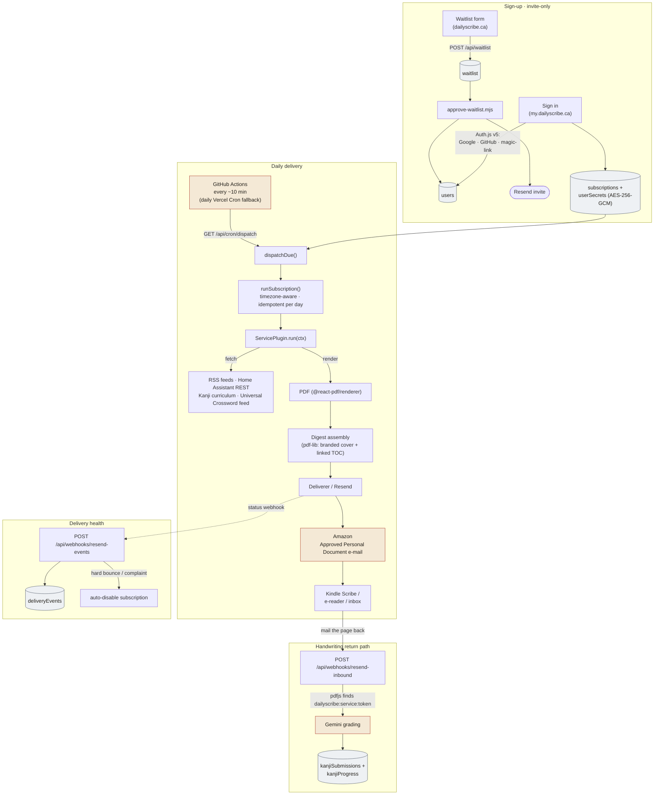

# Daily Scribe

**[dailyscribe.ca](https://dailyscribe.ca)** — pick from a catalogue of daily
"services" (the news, a write-in crossword, Kanji practice, a Home Assistant
briefing), and Daily Scribe binds them into one PDF and emails it to your Kindle
Scribe, any other e-reader, or a plain inbox — one edition a day, timed to your
morning. The Kindle Scribe is locked down by Amazon but accepts PDFs by email —
this turns that one open channel into a personalised daily edition. Some services
also read back: write your answers on the device by hand, mail the page to
`my@dailyscribe.ca`, and it is graded automatically.

**▶ [Watch the 2-minute demo](https://www.youtube.com/watch?v=ajOA1lpTtQI)** — a real
edition opened on a Kindle Scribe: the news sections, the Home Assistant briefing,
Kanji practice, and the write-in crossword.

[](https://www.youtube.com/watch?v=ajOA1lpTtQI)

## Status

Private beta, **invite-only** (`ALLOW_NEW_SIGNUPS=false`; the Auth.js `signIn`
callback rejects any address not already in `users`). The public site runs a
waitlist form; `apps/web/scripts/approve-waitlist.mjs` seeds approved emails into
`users` in small batches and sends the invite. See the roadmap in
[`CLAUDE.md`](./CLAUDE.md).

## Architecture



Every `[( … )]` node is a collection in a single **MongoDB Atlas** database
(`dailyscribe`); the app has no other datastore. **Cloudflare** hosts DNS only —
DKIM/SPF/DMARC for the sending domain, the MX record that points inbound mail at
Resend, and the CNAMEs for both Vercel projects.

There is no job queue and no per-user cron. A GitHub Actions workflow
(`.github/workflows/dispatch.yml`) polls `GET /api/cron/dispatch` every ~10 minutes,
with a once-daily Vercel Cron as a fallback. Each subscription carries a delivery
time and an IANA timezone, and `dispatchDue()` sends a subscriber's edition on the
first poll at or past that local time — **exactly once per day**, enforced by a
`deliveries` marker row keyed by `(userId, service, localDate)`. (Vercel Hobby cron
alone only fires daily, which can't honour a per-subscriber time across timezones;
native hourly Vercel Cron on Pro is the eventual replacement — see `CLAUDE.md`
Phase 3.)

## Monorepo layout

pnpm + Turborepo. `pnpm-workspace.yaml` → `apps/*`, `packages/*`.

| Workspace | Package | What it owns |
| --- | --- | --- |
| `apps/web` | `@dailyscribe/web` | The dashboard, Auth.js, every API route, the cron dispatcher (`lib/runner.ts`), and all service plugins + PDF renderers (`lib/plugins/*.tsx`). Deploys to `my.dailyscribe.ca`. |
| `apps/marketing` | `@dailyscribe/marketing` | The public site at `dailyscribe.ca` + `www`, the cross-origin waitlist form, and a git-based [Decap CMS](https://decapcms.org/) at `/admin` for the landing copy. No database, no auth. |
| `packages/core` | `@dailyscribe/core` | Framework-free TS: Mongo client + `collections()` / `ensureIndexes()`, AES-256-GCM secret crypto, the `ServicePlugin` interface + registry, the `Deliverer` abstraction, `pdf-lib` merge/split, an SSRF guard, and the Gemini kanji-grading client. Ships raw `.ts`, consumed directly. |
| `packages/theme` | `@dailyscribe/theme` | Shared design tokens (an oklch newsprint palette) and `next/font` config (Playfair Display + PT Serif), imported by both apps so product and marketing read as one brand. |

## Stack

- **App:** Next.js 15 (App Router), React 19, TypeScript.
- **Data:** MongoDB Atlas (free M0). Auth.js MongoDB adapter + app collections.
- **Auth:** Auth.js (NextAuth v5) — Google, GitHub, and Resend email magic-link,
  behind an invite-only `signIn` gate.
- **Email:** [Resend](https://resend.com/) — one verified sender
  (`Daily Scribe <my@dailyscribe.ca>`), one app-wide API key, no per-user
  credentials. Handles outbound editions, magic links, invites, and both the
  inbound-mail and delivery-status webhooks.
- **Scheduling:** a GitHub Actions workflow polls `GET /api/cron/dispatch` (guarded
  by `CRON_SECRET`) every ~10 min; a daily Vercel Cron is the fallback.
- **PDF:** `@react-pdf/renderer` for every rendered service; `pdf-lib` for stitching
  a digest and drawing its cover/TOC links; `pdfjs-serverless` to read mailed-back
  pages.
- **AI:** Google Gemini (`@google/genai`) — used only to grade a mailed-back Kanji
  practice page.
- **Hosting / DNS:** Vercel (two projects) + Cloudflare (DNS only).

## The pipeline

1. **Dispatch.** A GitHub Actions workflow calls `/api/cron/dispatch` every ~10
   minutes (a daily Vercel Cron is the fallback). `dispatchDue()` loads every
   enabled subscription and sends to each subscriber whose chosen delivery time has
   already passed in their own timezone and whose edition hasn't gone out yet today;
   it skips a user's standalone services if they have the Digest enabled.
2. **Run.** `runSubscription()` decrypts any needed secrets and calls
   `getPlugin(service).run(ctx)`. A plugin fetches its source (an RSS feed, the
   user's Home Assistant REST API, the Kanji curriculum, the Universal Crossword
   feed) and returns one or more PDF `Asset`s. A successful send writes a
   `deliveries` row; a failure writes one too, and never throws.
3. **Assemble (digest only).** `collectDigestSections()` runs each member service
   with per-member failure isolation, then `assembleDigestPdf()` (pdf-lib) prepends
   a branded cover + a linked table of contents and draws a back-to-contents link
   on every page.
4. **Deliver.** `createResendDeliverer().deliver()` sends the PDF from the single
   verified address. The user has whitelisted `my@dailyscribe.ca` once in Amazon's
   *Approved Personal Document E-mail List*, so Amazon forwards it to the device.
5. **Return path.** The user writes on the page and mails it back. The domain's MX
   points all inbound mail at Resend, whose webhook hits
   `/api/webhooks/resend-inbound`. `pdfjs-serverless` scans the pages for the
   embedded `dailyscribe:<service>:<token>` routing ref, trims the PDF to that
   service's pages, and (for Kanji) sends it to Gemini for a per-character verdict
   that updates `kanjiProgress`.
6. **Delivery health.** Resend's status webhook (`/api/webhooks/resend-events`)
   records deliveries, bounces, and complaints in `deliveryEvents` and
   auto-disables any subscription whose address hard-bounced or filed a complaint;
   the dashboard shows why.

## Service plugin model

A service is a `ServicePlugin` — `{ id, label, run(ctx): Promise<Asset[]> }`
(`packages/core/src/plugins/index.ts`). Plugins are registered once at the top of
`apps/web/lib/runner.ts`; their implementations live in
`apps/web/lib/plugins/*.tsx`. `apps/web/lib/service-catalog.ts` is the single source
of truth for a service's *identity* (label, icon, blurb, whether it needs a stored
secret, whether it appears in onboarding) and drives the dashboard tabs, the
onboarding picker, and the digest's member list.

**Live:** RTÉ / CBC / BBC news, Home Assistant summary, Kanji-a-day, the write-in
(Universal) crossword, plus the **Digest** bundle. **Coming:** DnD 5e, serialized
classic novels, an eating/drinking tracker. **Paused:** the NYT crossword plugin
still exists but is excluded from the catalogue (it needs the subscriber's own
cookies).

## Local development

```bash
pnpm install
pnpm dev        # both apps via Turborepo
pnpm test       # vitest in packages/core
pnpm typecheck
pnpm build
```

Requires Node ≥ 20 and pnpm 9. The apps need environment variables and a handful of
external accounts (MongoDB Atlas, Resend, OAuth apps, a Gemini key) to do anything
real — [`SETUP.md`](./SETUP.md) walks through every variable and the one-time
service setup, and finishes with an end-to-end "you as customer #1" checklist.

## Repo map

- [`CLAUDE.md`](./CLAUDE.md) — vision, the chosen stack and why, and the phased
  roadmap. Start here for intent.
- [`SETUP.md`](./SETUP.md) — environment variables, external-service setup, deploy,
  and verification.
- `.env.example` — annotated inventory of every environment variable.
